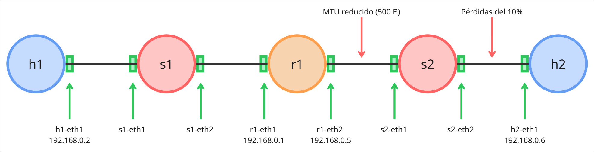

# TP N°1 : File Transfer

## Contenido

Este proyecto implementa una aplicación cliente-servidor para la transferencia de archivos sobre una red simulada, utilizando el protocolo UDP con mecanismos de recuperación de errores. Se desarrollaron dos versiones del protocolo de transferencia confiable: Stop & Wait y Selective Repeat, aplicadas a operaciones de upload y download. La solución fue construida en Python usando la interfaz de sockets y validada sobre una topología creada en Mininet.

## Autores

| Nombre          | Apellido      | Mail                  | Padrón |
| --------------- | ------------- | --------------------- | ------ |
| Ian             | von der Heyde | ivon@fi.uba.ar        | 107638 |
| Agustín         | Altamirano    | aaltamirano@fi.uba.ar | 110237 |
| Juan Martín     | de la Cruz    | jdelacruz@fi.uba.ar   | 109588 |
| Cristhian David | Noriega       | cnoriega@fi.uba.ar    | 109164 |
| Santiago Tomás  | Fassio        | sfassio@fi.uba.ar     | 109463 |

## Estructura del repositorio

```
 📁 FIUBA-REDES-TP1/ 
  ├── 📄 README.md                         # Documento principal con instrucciones de uso y ejecución
  ├── 📊 Informe.pdf                       # Informe académico que detalla el desarrollo del trabajo práctico
  ├── 📂 docs/...                          # Archivos complementarios para la documentación
  └── 📂 src/                              # Código fuente principal del proyecto
      ├── 📂 tests/...                     # Scripts de simulación de red (Mininet) para probar protocolos
      ├── 📤 upload.py                     # Cliente para enviar archivos al servidor
      ├── 📥 download.py                   # Cliente para descargar archivos desde el servidor
      ├── ⚙️ start-server.py               # Script para iniciar el servidor que maneja las transferencias
      └── 📂 lib/                          # Módulos principales
          ├── [...]                        
          └── 📂 transport_protocols/      # Implementación de protocolos de transporte desarrollados
               ├── 📦 protocol_segment.py  # Definición de la estructura de segmentos de red
               ├── 🤝🏼 stop_and_wait.py     # Implementación del protocolo Stop-and-Wait
               └── 🤝🏼 selective_repeat.py  # Implementación del protocolo Selective Repeat
```

---

## Requisitos

Para ejecutar este proyecto, asegurarse de tener instalados los siguientes paquetes en tu sistema basado en Debian/Ubuntu:

- **Python**: lenguaje de programación utilizado en el proyecto.
- **Mininet**: entorno de simulación de redes.
- **Open vSwitch Test Controller**: controlador simple para pruebas.
- **xterm**: terminal gráfica utilizada por Mininet.
-  **Wireshark** (opcional): herramienta para capturar y analizar tráfico de red.

Puedes instalarlos con los siguientes comandos:

```bash
sudo apt install python3
sudo apt install openvswitch-testcontroller
sudo ln -s /usr/bin/ovs-testcontroller /usr/bin/controller
sudo apt install mininet
sudo apt install xterm  
sudo apt install wireshark
```

### (Opcional) Configurar tamaño de fuente de xterm

Para ajustar el tamaño de fuente de las terminales `xterm` (por ejemplo, utilizar la fuente *Monospace* con tamaño 14), siga estos pasos:

1. Cree un archivo llamado `.Xresources` en su directorio personal (`/home/usuario/`) con el siguiente contenido:

    ```
    XTerm*faceName: Monospace
    XTerm*faceSize: 14
    ```

2. Aplique la configuración ejecutando el siguiente comando en una terminal:

    ```bash
    xrdb -merge ~/.Xresources
    ```

---

## Ejecución

### Cómo ejecutar el servidor

El servidor se encarga de almacenar y servir archivos a los clientes. Para iniciarlo, utilizá el siguiente comando:

```bash
python3 src/start-server.py -H <IP_SERVIDOR> -p <PUERTO> -s <DIRECTORIO_DE_ALMACENAMIENTO> -r <PROTOCOLO>
```

#### Ejemplo:

```bash
python3 src/start-server.py -H localhost -p 8080 -s storage_dir -r sr
```

#### Argumentos disponibles:

* `-h, --help`: muestra la ayuda y finaliza
* `-v, --verbose`: incrementa el nivel de verbosidad
* `-q, --quiet`: reduce el nivel de salida
* `-H, --host`: dirección IP del servidor
* `-p, --port`: puerto del servicio
* `-s, --storage`: ruta del directorio de almacenamiento
* `-r, --protocol`: protocolo de recuperación ante errores (por ejemplo: `sr`)

---

### Cómo ejecutar el cliente

El cliente permite enviar archivos al servidor (`upload`) o descargarlos (`download`).

#### Comando para subir un archivo (`upload`):

```bash
python3 src/upload.py -H <IP_SERVIDOR> -p <PUERTO> -s <ARCHIVO_ORIGEN> -n <NOMBRE_REMOTO> -r <PROTOCOLO>
```

##### Ejemplo:

```bash
python3 src/upload.py -H localhost -p 8080 -s archivo_a_enviar.txt -n nombre_de_guardado.txt -r sr
```

#### Comando para descargar un archivo (`download`):

```bash
python3 src/download.py -H <IP_SERVIDOR> -p <PUERTO> -d <DESTINO_LOCAL> -n <NOMBRE_REMOTO> -r <PROTOCOLO>
```

##### Ejemplo:

```bash
python3 src/download.py -H localhost -p 8080 -d nombre_directorio -n archivo_a_descargar.txt -r sr -v
```

#### Argumentos disponibles (cliente):

* `-h, --help`: muestra la ayuda y finaliza
* `-v, --verbose`: incrementa el nivel de verbosidad
* `-q, --quiet`: reduce el nivel de salida
* `-H, --host`: dirección IP del servidor
* `-p, --port`: puerto del servidor
* `-s, --src`: ruta del archivo fuente (solo en upload)
* `-d, --dst`: ruta de destino del archivo descargado (solo en download)
* `-n, --name`: nombre del archivo remoto (nombre con el que se guarda o solicita)
* `-r, --protocol`: protocolo de recuperación ante errores (`sr`, `sw`)

> ⚠️ **¡Importante!**
> El usuario es responsable de asegurarse de que el **protocolo seleccionado** (`-r`) sea el **mismo** tanto en el cliente como en el servidor.  
> Si hay una discrepancia, el comportamiento del sistema no está garantizado y puede provocar errores de comunicación o pérdida de datos.


---

## Simulaciones


---

###  Cómo ejecutar la simulación de **pérdida de paquetes**

#### 1. Iniciar la topología en Mininet

Ejecutá el siguiente comando para lanzar la simulación con la topología definida:

```bash
sudo python3 src/tests/simulation-pkg-loss.py
```

Esto va a:

* Crear una red con un servidor, tres clientes y un router.
* Configurar una pérdida del 10% en el enlace entre el servidor y el switch `s1`.
* Abrir terminales `xterm` para los hosts (`server`, `h2`, `h3`, `h4`) para que puedas ejecutar comandos directamente.

---

#### 2. Ver tráfico con Wireshark (opcional)

Si quieres observar el tráfico de red:

1. Abre **Wireshark**.
2. Seleccione una de las interfaces virtuales, como `s1-eth1`, `r1-etserver` o `r1-eth2`.
3. Desde la terminal `xterm` del host **`server`**, ejecute el servidor.
4. Desde las terminales `xterm` del resto de los hosts (**`h2`**, **`h3`**, **`h4`**), ejecute los clientes para realizar operaciones de subida o descarga.
--- 

### Cómo ejecutar la simulación de **fragmentación**

Este test permite analizar cómo se comporta una red frente a la fragmentación de paquetes IP, una MTU reducida y pérdidas de paquetes.

#### Diseño de la simulación

La topología de red utilizada se muestra en la siguiente imagen:




* `h1` y `h2` son los hosts emisor y receptor, respectivamente.
* La red incluye dos switches (`s1`, `s2`) y un router (`r1`).
* El enlace que une `r1` con `s2` tiene una **MTU reducida a 500 bytes**, lo que genera fragmentación.
* El enlace entre `s2` y `h2` introduce **una tasa de pérdida del 10%**, simulando una red no confiable.
* Las IP asignadas a cada host/router están detalladas en la imagen para facilitar la configuración manual o el análisis con herramientas como Wireshark.

---

#### 1. Iniciar la topología en Mininet

Ejecutar el script de simulación con privilegios de superusuario:

```bash
sudo python3 src/tests/simulation-fragmentation.py
```

Esto levanta la topología virtual descrita arriba.

#### 2. Monitorear el tráfico (opcional)

Para inspeccionar el tráfico de red:

* Abrir **Wireshark**.

* Seleccionar una interfaz virtual, por ejemplo `s1-eth1` o `s2-eth2`.

#### 3. Enviar tráfico entre hosts

En las terminales `xterm` correspondientes a los hosts:

* **Servidor (`h2`)**:

  ```bash
  iperf -s [-u]
  ```
- `-s`: pone al host en modo servidor, esperando conexiones de clientes.

- `-u` (opcional): le indica que reciba tráfico en protocolo **UDP**. Si no se usa, será **TCP** por defecto.


* **Cliente (`h1`)**:

  ```bash
  iperf -c <IP_DEL_SERVIDOR> -n <TAMAÑO_EN_BYTES> [-u]
  ```
- `-c` <IP_DEL_SERVIDOR>: conecta al cliente con el servidor iperf especificando su dirección IP.

- `-n` <TAMAÑO_EN_BYTES>: envía una cantidad fija de datos (por ejemplo: 10M para 10 megabytes).

---

#### 4. Ejemplo práctico utilizado en el informe

* En `h2`:

  ```bash
  iperf -s -u
  ```

* En `h1`:

  ```bash
  iperf -c 192.168.0.6 -n 144K -u
  ```

Este flujo de datos simula el envío de paquetes que deben ser fragmentados (por la MTU reducida) y que pueden perderse (por la tasa de pérdida del 10%), permitiendo evaluar la resiliencia de distintos protocolos de recuperación de errores.
